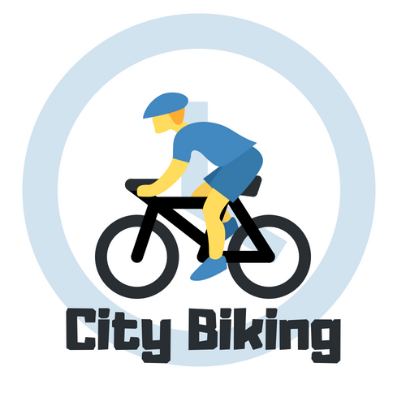

    

City Biking
---
NodeJS alexa skill for finding information on city bikes in your town.

### Concept

You can ask the city biking alexa skill for information on the number of city bikes at stations across the United States.
This alexa skill will understand fuzzy queries about particular streets and locations, and give you the number of free bikes at these locations in real time.

Find out how many bikes there are before you leave the house.

Works in most major US cities.

Submitted for the 2018 AWS Alexa Skill challenge - <a href="https://alexatechforgood.devpost.com/">Tech for Good</a>

#### Going after challenges:
* Best Use of Advanced Alexa Developer features: <b>(persistence)</b>.
* Best Natural Resource Efficiency Skill (tracking and encouraging community biking).
* Best Sustainable Transportation Skill
* Best Use of Open-sourced Data (using open source biking facts to help users find reasons for biking).

### Usage
You can ask the city biking alexa skill for information on the number of city bikes at stations across the United States.

* <b>Alexa, ask city biking for bikes in Los Angeles.</b>
* <b>Alexa, ask city biking about bikes in Boston.</b>
 
etc...

### Supported Cities

<pre>
Aspen, CO
Miami Beach, FL
San Francisco Bay Area, CA
San Diego, CA
Denver, CO
Boulder, CO
Fort Lauderdale, FL
Des Moines, IA
Charlotte, NC
Fort Worth, TX
Salt Lake City
Greenville, SC
Houston, TX
Kansas City, MO
Madison, WI
Nashville, TN
Omaha, NE
San Antonio, TX
Spartanburg, SC
Fargo, ND
Austin, TX
Indianapolis, IN
Milwaukee, WI
Evans, GA
Savannah, GA
Rapid City, SD
Pittsburgh
El Paso, TX
Battle Creek, MI
Dayton, OH
Philadelphia, PA
West Palm Beach Florida
Ann Arbor, MI
Portland, OR
San Ramon, CA
Boise, ID
Santa Monica, CA
Buffalo, NY
Washington, DC
New York, NY
Cincinnati, OH
Tampa, FL
Columbus, OH
Chicago, IL
Phoenix, AZ
Boston, MA
Orlando, FL
Los Angeles, CA
Ketchum / Sun Valley, ID
Minneapolis, MN
University of South Florida, FL
Long Beach, NY
Topeka, KS
University of Virginia, VA
Atlanta, GA
Chattanooga, TN
Kent State
Hoboken
Weehawken
Bayonne
Guttenberg
West New York
North Bergen
Liberty State Park
</pre>

#### Bonus:
This skill can also give you healthy biking tips.

* <b>Alexa, ask city biking for a biking fact.</b>

### Dev Notes

Compression
<pre>
    zip -r -X ../src.zip *
 </pre>

### Useful links
* http://www.ilovebicycling.com/biking-facts/
* https://api.citybik.es/v2